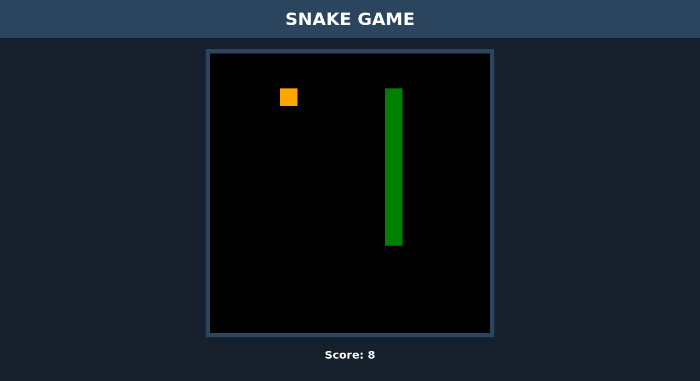

# Snake Game

## Sobre o projeto

Projeto realizado como atividade prática durante treinamento da [Digital Innovation One](https://digitalinnovation.one/).

## Descrição do projeto

Desenvolver de forma simples o clássico jogo da cobrinha utilizando HTML, CSS e JavaScript.

## Tecnologias utilizadas

- HTML

- CSS

- JavaScript

## Resultado final

Além de desenvolver um design personalizado, implementei uma contagem de pontos.

Para executar o projeto, basta clonar para um repositório local e dentro da pasta abrir o arquivo `index.html` em qualquer navegador moderno. Se preferir pode fazer o download e depois descompactar.

**Obs.:** Não responsivo.

## Licença

Esse projeto está sob a licença MIT. Veja o arquivo [LICENSE](LICENSE.md) para mais detalhes.